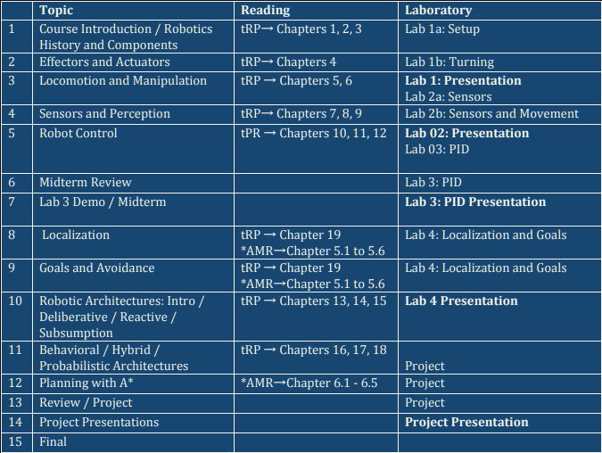

# Pololu Robotics at Marist

## Course Description:

This is a hands-on course where the student will learn about robots and about several aspects
related to robot design and programming. The course covers material related to mechanical
design, issues related to planning and reasoning under uncertainties, and sensors and control.
Students will apply the techniques learned in a real robot system, using a commercial robotics kit
and programming environment.

# Required Materials:

## Required Textbooks:

Mataric, Maja J, “The Robotics Primer”, MIT Press, 2007.
ISBN-13: 978-0262633543
ISBN-10: 026263354X

## Recommended Texts:

Siegwart, R, et al. “Introduction to Autonomous Mobile Robots”, MIT Press, 2011.
ISBN-13: 978-0262015356
ISBN-10: 8120343220

## Supplemental (Optional) Texts:

Braitenberg, Valentino, “Vehicles: Experiments in Synthetic Psychology”, MIT Press, 1984.
ISBN-13: 978-0262521123
ISBN-10: 0262521121

## Course Schedule

